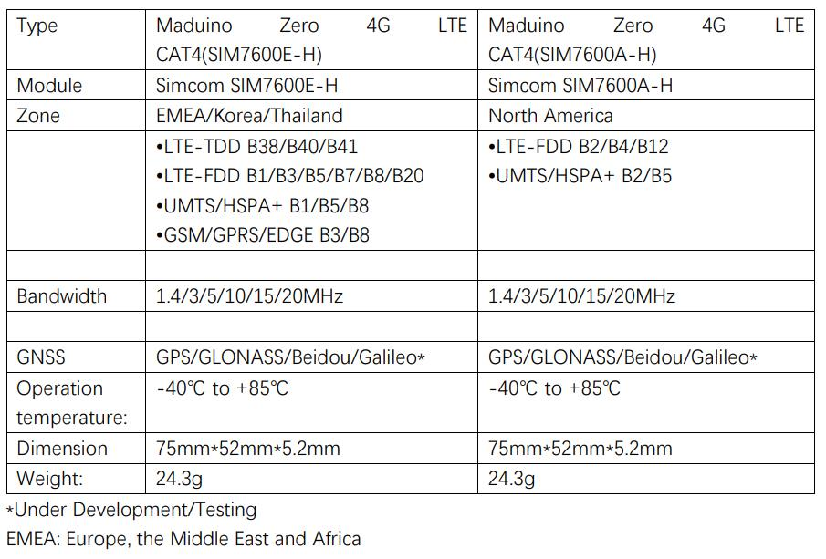

# Maduino Zero 4G LTE CAT1

```c++
/*
Version:		V1.0
Author:			Vincent
Create Date:	2021/11/5
Note:
	
*/
```


[toc]

# Makerfabs

[Makerfabs home page](https://www.makerfabs.com/)

[Makerfabs Wiki](https://makerfabs.com/wiki/index.php?title=Main_Page)

# Maduino Zero 4G LTE CAT1
## Intruduce

Product Link ：[]() 

Wiki Link : [Maduino Zero 4G LTE CAT1](https://www.makerfabs.com/wiki/index.php?title=Maduino_Zero_4G_LTE_CAT1) 

Maduino Zero 4G LTE CAT1 integrated two types of the 4G LTE module SIM7600A or SIM7600E, SIM7600A/SIM7600E is a complete multi-band LTE-FDD/LTE-TDD/HSPA+/UMTS/EDGE/GPRS/GSM module solution in LCC type which supports LTE CAT1 up to 10Mbps for downlink and 5Mbps for uplink data transfer, much faster and popular than 2G.

## Module Type




## Feature

- Supports dial-up, phone, SMS, TCP, UDP, DTMF, HTTP, FTP, and so on
- Dual USB Type C port
- Control Via AT Commands
- Board USB supply voltage range: 4.8~5.5V, 5.0V Typical
- Board Battery supply voltage range: 3.4~4.2V, 3.7V Typical
- 3GPP E-UTRA Release 11
- Onboard charger, up to 1A charge current
- Overcharge protection(OCP), 4.3V
- Over-discharge protection(ODP), 2.5V
- Power Manager, the board can be supplied by USB or battery.
- IPEX Antenna, GSM/UMTS/LTE main antenna. UMTS/LTE auxiliary antenna. GNSS antenna
- SMS support
- Audio support
- On boarder controller: ATSAMD21G18A
- Audio chip: NAU8810
- Level Shifter: TXS0108E


### Front:


### Back:


### Frequency bands


### Transfer Speed


# Usage （Arduino）

## Equipment list


- Maduino Zero 4G (With GPS antenna and two 4G-GSM antennas)
- SIM card 

*Ensure that SIM7600 requirements are met and that the system can communicate with local carriers. We used China Mobile's 4G card for testing.*


## Compiler Options

**If you have any questions，such as how to install the development board, how to download the code, how to install the library. Please refer to :[Makerfabs_FAQ](https://github.com/Makerfabs/Makerfabs_FAQ)**

- Connect all antennas
- Insert a SIM card
- Connect **USB for MCU** to PC
- Upload codes, select "Arduino Zero" and "Native USB"


## Example List

### AT_command_demo

Input AT commands via serial monitor to learn how to use 4G module. This version is modify for SIM7600.

If define MODE_1A, when "1A" or "1A" is entered, 0x1A is sent to the module.

When sending SNS information, you need to send 0x1A to end the input.


## AT Command Explain

###  AT commands test

Refer to the official AT manual of SIM7600 for detailed return values.

```c++
    AT+CGMI    // Request manufacturer identification
    AT+CGMM    // Request model identification
    AT+CGSN    // Request product serial number identification
    AT+CSUB    // Request the module version and chip
    AT+CPIN?     // Request the state of the SIM card
    AT+CICCID    // Read ICCID from SIM card
    AT+CNUM      // Request the subscriber number
    AT+CNMP?     // Preferred mode selection
    AT+COPS?     // Check the current network operator
```

### Get the GNSS location

GPS signal acquisition speed depends on signal strength, please wait patiently in an open place.

```c++
    AT+CGPS=1      // Start GPS session 
    AT+CGPSINFO    // Get GPS fixed position information
    AT+CGPS=0      // Stop GPS session
```

### Send and receive SMS

Please consult the operator for the phone number of the SMS center. The number "+8613800755500" in Shenzhen was used in the test. 

```c++
    AT+CSCA="XXXXXX"       // Set the SMS service centre address
    AT+CMGF=1              // Select SMS message format
    AT+CMGS="xxxxxx"       // Send message to "xxxxxx"(the receiver number).
```

"AT+CMGS" sets the phone number of the receiver and returns ' >' . Send desired content, such as "Send Massage Test!".After editing a short message, send it in hexadecimal format 1A Send a message.

*The Arduino IDE cannot send hexadecimal,  you can use other software. In the example code, entering 1A or 1A will send 0x1A to the module.*


# Usage （Raspberry Pi）

## Equipment list


- Maduino Zero 4G (With GPS antenna and two 4G-GSM antennas)
- SIM card 

*Ensure that SIM7600 requirements are met and that the system can communicate with local carriers. We used China Mobile's 4G card for testing.*

- Connect all antennas
- Insert a SIM card
- Connect **USB for MCU** to Raspberry Pi USB

## Used as a 4G network adapter

### Hardware Check

- 进入root账户，后续所有操作都在root账户下进行。

```shell
sudo su
```

- 安装minicom串口工具


```shell
apt-get install minicom
```

- 查看串口设备，AT指令串口，为/dev/ttyUSB2

```shell
ls /dev/ttyUSB*
```


- 用minicom打开串口

```shell
minicom -D /dev/ttyUSB2
```

- 在minicom中输入AT指令

```shell
# 强制设置为4G上网
AT+CNMP=38
# 查询网络质量
AT+CSQ
# 查询网络注册状
AT+CREG?
# 查询网络运营商
AT+COPS?
# 查询网络波段
AT+CPSI?
```


- 按下Ctrl + A，然后按X退出minicom

至此，SIM7600CE和Raspberry Pi硬件连接正常，网络连接正常。本案例使用了中国移动的4G卡，其余区域如果无法使用，请咨询SIMCOM。


### Driver Install

Raspberry Pi的Raspbian系统，默认是安装了高通的用于wwan0网口的驱动模块文件。对于Raspberry Pi，需要先卸载该驱动(不然会与新装的驱动冲突)，再安装上simcom的用于wwan0网口的驱动模块文件.

- 使用查看系统驱动

```shell
lsmod
```


- 卸载已有驱动

```shell
rmmod qmi_wwan
```

- 安装树莓派内核头文件
```shell
apt install raspberrypi-kernel-headers
```
- 下载SIMCOM官方提供的驱动模块源程序
```shell
wget https://www.waveshare.net/w/upload/0/00/SIM7600_NDIS.7z
```
- 安装解压工具并解压
```shell
apt-get install p7zip-full
7z x SIM7600_NDIS.7z -r -o ./SIM7600_NDIS
```
- 进入驱动文件夹，并编译

```shell
cd SIM7600_NDIS
make clean
make
ls
```

安装该驱动模块文件

```shell
insmod simcom_wwan.ko
```

- 查看是否安装成功
```shell
lsmod
```


### 开始拨号，并分配IP

- 此时，可看到已经出现wwan0网口

```shell
ifconfig -a
```
- 但是该网口并未分配IP地址，如需分配IP，需要先开启网口

```shell
ifconfig wwan0 up
```
- 然后，通过minicom，输入AT指令开始拨号

```shell
minicom -D /dev/ttyUSB2
AT$QCRMCALL=1,1
```
- 最后，退出minicom，分配IP

```shell
apt-get install udhcpc
udhcpc -i wwan0
```
- 使用Ping命令测试网卡是否联网

```shell
ping -I wwan0 www.baidu.com
```

